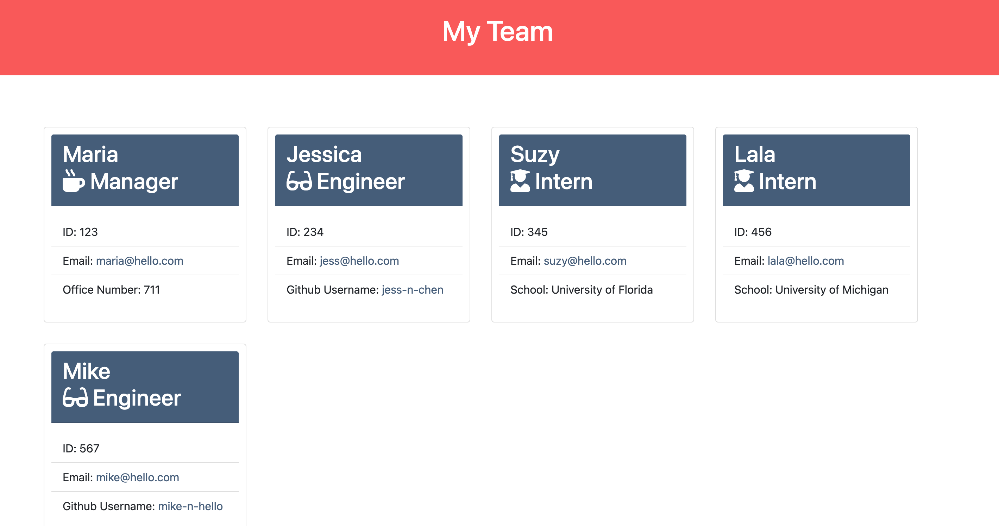

# Jessica Chen - Team Profile Generator

## Columbia University Bootcamp - Object-Oriented Programming Challenge: Team Profile Generator

> This repository contains my command line application that generates a team profile HTML page using a series of questions prompted to the end user.
> Link to Application Walkthrough: https://drive.google.com/file/d/1Cpoh9Qm93bq3BZACWV82fhLEUmi_CJtG/view

## Table of Contents

- [General Info](#general-information)
- [Project Requirements](#project-requirements)
- [Installation](#installation)
- [Test](#tests)
- [Screenshots](#screenshots)
- [Contact](#contact)

## General Information

This repository contains the code for my command line application that prompts the end user with a series of questions about their team members and their information to generate a HTML page with a formatted team roster with quick access to members' emails and GitHub profiles.

## Project Requirements

User Story:

```
AS A manager
I WANT to generate a webpage that displays my team's basic info
SO THAT I have quick access to their emails and GitHub profiles
```

Acceptance Criteria:

```
GIVEN a command-line application that accepts user input
WHEN I am prompted for my team members and their information
THEN an HTML file is generated that displays a nicely formatted team roster based on user input

WHEN I click on an email address in the HTML
THEN my default email program opens and populates the TO field of the email with the address

WHEN I click on the GitHub username
THEN that GitHub profile opens in a new tab

WHEN I start the application
THEN I am prompted to enter the team manager’s name, employee ID, email address, and office number

WHEN I enter the team manager’s name, employee ID, email address, and office number
THEN I am presented with a menu with the option to add an engineer or an intern or to finish building my team

WHEN I select the engineer option
THEN I am prompted to enter the engineer’s name, ID, email, and GitHub username, and I am taken back to the menu

WHEN I select the intern option
THEN I am prompted to enter the intern’s name, ID, email, and school, and I am taken back to the menu

WHEN I decide to finish building my team
THEN I exit the application, and the HTML is generated
```

## Installation

1. Clone the repository to your local drive.
2. Run `npm install` in order to install the npm package dependencies as specified in the package.json file.
3. Run `node index.js` in the command line to use the application.

## Tests

There are tests provided with this repository source code. Use `npm run test` after the application is installed to run tests using jest.

## Screenshots



## Contact

Created by: Jessica Chen | jessicachen28@gmail.com
